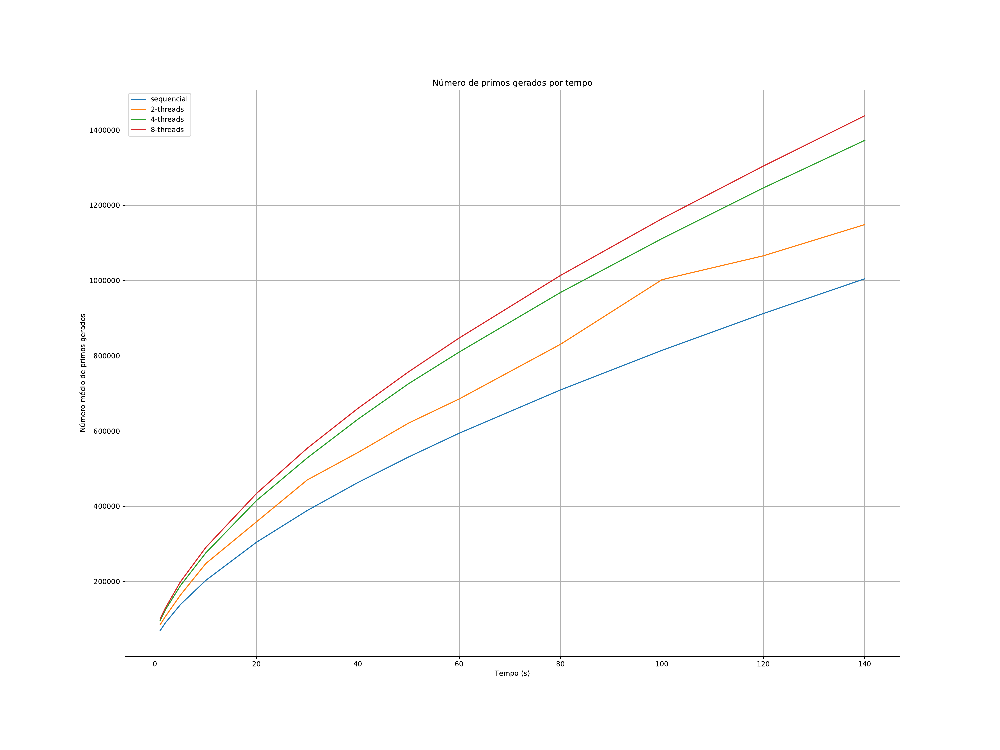

# Geração de primos

Esse repositório contém o código para um trabalho da disciplina de Sistemas Distribuídos no CEFET-MG Timóteo. O código aqui presente, gera números primos indefinidamente (respeitando os limites do tamanho das variáveis) por **N** segundos de duas formas diferentes: uma abordagem sequencial e outra concorrente.

A geração concorrente acontece da seguinte forma:

1. Uma variável inteira armazena um número inicial.
2. Cada thread incrementa esse valor e verifica se o valor incrementado é primo (utilizando **mutex** para travar as partes críticas). Cada uma das threads executam um loop infinito.
3. Se o número for primo, uma variável de contagem de números primos é incrementada, também utilizando um **mutex** para garantir a consistência. Um segundo objeto **mutex** é utilizado para que não haja travamentos desnecessários nas outras threads que estejam utilizando um **lock** com o primeiro **mutex**. Nossos experimentos mostraram que dois **mutexes** permitem gerar mais primos do que apenas um.
4. Esse processo é executado por **N** segundos.
5. No final, a variável de contagem de primos é impressa no **stdout**.

A geração concorrente acontece da seguinte forma:

1. Uma variável inteira armazena um número inicial.
2. Enquanto **N** segundos não se passarem, incrementamos o valor e verificamos se este é primo.
3. Se o número for primo, uma variável de contagem de números primos é incrementada.
4. No final, a variável de contagem de primos é impressa no **stdout**.

## Estratégia de análise de desempenho

* Gerar números primos sequencialmente por 5, 10, 20, 30, 40, 50, 60, 80, 100, 120 e 140 segundos, testando 10 vezes cada um dos tempos para que possamos tirar a média dos valores obtidos e diminuir a incerteza.
* Gerar números primos concorrentemente por 5, 10, 20, 30, 40, 50, 60, 80, 100, 120 e 140 segundos com 2, 4 e 8 threads, testando 10 vezes cada um dos tempos para que possamos tirar a média dos valores obtidos e diminuir a incerteza.
* Plotar tudo em um gráfico e analisar.

## Resultados

    

## Autores

[Leonam Teixeira de Vasconcelos](https://github.com/leonamtv)

[André Marcelino de Souza Neves](https://github.com/AndreNeves97)
